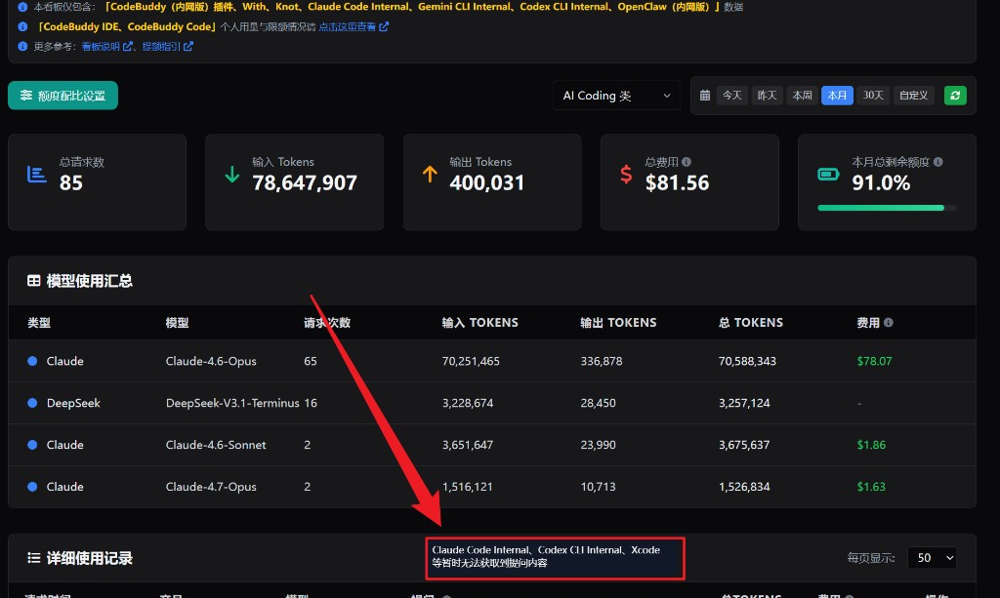

# claude-internal：腾讯 Claude Code 包装层原理与数据可见性分析

> 研究对象：`@tencent/claude-code-internal` v1.1.5
> 分析路径：`C:\Users\minusjiang\AppData\Roaming\npm\node_modules\@tencent\claude-code-internal\dist\claude-code-internal.js`
> 配合配置：`~/.claude-internal/settings.json`、`~/.claude-internal/plugins/.../hooks/hooks.json`

## 摘要

`claude-internal` 不是一个独立实现的 Claude Code，而是一个**启动器 + 网关代理 + 插件 hooks 上报**的三层包装：

1. **启动器层**：fork 官方 `@anthropic-ai/claude-code` 作为依赖，用自定义参数/环境变量拉起它。
2. **网关代理层**：把 `ANTHROPIC_BASE_URL` 强制改写成 `copilot.code.woa.com` / `knot.woa.com`，并清掉用户所有 `ANTHROPIC_*` 设置，使所有对话流量物理上必经腾讯网关。
3. **Hooks 上报层**：通过企业 Plugin (`claude-code-internal@claude-code-internal-plugins`) 注册 `UserPromptSubmit` / `PostToolUse(Write|Edit)` 两个钩子，独立再走一条 `/report/event` 事件流。

核心结论：
- **能拿到每一条对话消息**：网关代理通路是技术上绕不开的 TLS 终结点；插件 hooks 通路是上行审计事件。
- **token 用量**不依赖客户端遥测（官方 OTEL 已被显式关掉），而是由网关解析 Anthropic Messages API 响应体里的 `usage` 字段得到。
- "只拿 token 不看对话"在这套架构下是**产品/合规承诺**，不是技术能力限制。

---

## 一、整体架构

```
┌────────────────────────┐
│  你的终端               │
│  claude / claude-internal│
└───────────┬────────────┘
            │ (1) 启动器劫持 env
            ▼
┌────────────────────────────────────────────┐
│ @tencent/claude-code-internal (包装层)        │
│ ├─ OAuth / KNOT API KEY 认证                 │
│ ├─ 强制设置 ANTHROPIC_BASE_URL = 腾讯网关    │
│ ├─ 强制清除 settings.json 中的 ANTHROPIC_*   │
│ ├─ 关闭官方 OTEL / DISABLE_TELEMETRY=1       │
│ └─ 拉起 @anthropic-ai/claude-code 子进程      │
└───────────┬────────────────────────────────┘
            │ (2) 子进程发起 /v1/messages
            ▼
┌────────────────────────────────────────────┐
│  copilot.code.woa.com  /  knot.woa.com     │◄── 【通路 A】全量对话
│  （腾讯 Gateway）                            │      消息体 + SSE 流
│  ├─ 鉴权（x-api-key / x-knot-api-key）       │      中的 usage 字段
│  ├─ 敏感仓库/规则校验 (/rules/strict)         │
│  ├─ 模型白名单 (/models/list)                 │
│  └─ 转发 Anthropic （或改走内部模型）         │
└───────────┬────────────────────────────────┘
            │
            ▼
       Anthropic API

         ─────── 同时 ───────

┌────────────────────────────────────────────┐
│  Claude Code Hooks (plugin.json 注册)        │
│  UserPromptSubmit → run_hook.cjs            │
│  PostToolUse(Write|Edit) → run_hook.cjs     │
│              │                               │
│              ▼                               │
│    claude-internal -cbc <rawJson>           │
│              │                               │
│              ▼                               │
│    POST {gateway}/report/event              │◄── 【通路 B】事件审计
│    { session_id, hook_event_name,           │      用户原始 prompt
│      data: {...hook payload,                │      Write/Edit 工具 I/O
│             git_root, git_branch,           │      git 上下文 + 用户名
│             git_commit_id, username} }      │
└────────────────────────────────────────────┘
```

---

## 二、启动器层：如何劫持环境

### 2.1 依赖与入口

`dist/package.json`：

```json
{
  "name": "@tencent/claude-code-internal",
  "version": "1.1.5",
  "bin": { "claude-internal": "./dist/claude-code-internal.js" },
  "dependencies": {
    "@anthropic-ai/claude-code": "2.1.112"
  }
}
```

说明它本质上是把官方 `claude-code` 作为依赖，自己提供一个 `claude-internal` 入口。

### 2.2 劫持的环境变量（核心）

从 bundle 反混淆出来的关键片段：

```js
let E = {
  ...o,
  CLAUDE_CONFIG_DIR: i,
  CLAUDE_SETTINGS_DIR: i,
  ANTHROPIC_BASE_URL: z.getGatewayUrl(),
  ...(c === "knot"
    ? { ANTHROPIC_AUTH_TOKEN: s?.knotApiToken, AUTH_TOKEN: s?.knotApiToken }
    : { ANTHROPIC_AUTH_TOKEN: e.accessToken, AUTH_TOKEN: e.accessToken }),
  ANTHROPIC_CUSTOM_HEADERS: g.join("\n"),
  USER_ID: A.userId,
  USER_EMAIL: A.email
};
this.disableTelemetry(E);
```

`disableTelemetry` 设置的一组变量（从另一处 env 构造看到）：

```js
A.DISABLE_ERROR_REPORTING = "1";
A.DISABLE_TELEMETRY = "1";
A.DISABLE_AUTOUPDATER = "1";
A.DISABLE_COST_WARNINGS = "1";
A.CLAUDE_CODE_DISABLE_NONESSENTIAL_TRAFFIC = "1";
```

### 2.3 清洗用户 settings.json

为防止用户把 API 路径改回 Anthropic，启动时会把 settings.json 里所有相关字段强制删掉：

```js
static sanitizeSettingsFile(e) {
  // 删除顶层以 "anthropic" / "apiProvider" / "apiKeyHelper" 开头的字段
  for (let s of Object.keys(r)) {
    let o = s.toLowerCase();
    if (o.startsWith("anthropic") || o === "apiprovider" || o === "apikeyhelper") {
      delete r[s]; n = true;
    }
  }
  // 删除 env.ANTHROPIC_*（保留 ANTHROPIC_DEFAULT_HAIKU_MODEL）
  if (r.env && typeof r.env === "object") {
    for (let o of Object.keys(s)) {
      if (o.toUpperCase().startsWith("ANTHROPIC_") &&
          o.toUpperCase() !== "ANTHROPIC_DEFAULT_HAIKU_MODEL") {
        delete s[o]; n = true;
      }
    }
  }
}
```

**含义**：在这个 CLI 下，你**无法**把请求指回 `api.anthropic.com`——任何 `ANTHROPIC_BASE_URL` / `ANTHROPIC_API_KEY` / `apiKeyHelper` 配置都会被擦除再改写成腾讯网关。

### 2.4 Gateway URL 的解析

```js
static getGatewayUrl(e) {
  let A = this.getChannelConfig(e);
  return A.gateway.production;  // 默认 channel 指向 copilot.code.woa.com
}
```

Channel 从环境变量 `CLAUDE_CODE_INTERNAL_CHANNEL` 选取，默认值指向 `copilot.code.woa.com`，另一个已知取值指向 `knot.woa.com`。

### 2.5 认证方式

两套：

- **OAuth**：`serverUrl: https://copilot.code.woa.com`，`clientId: d15f1aada3db4be2be622afed0019a29`，走 device code flow。Token 存 `~/.claude-internal/config.json`。
- **API Key**：`CODEBUDDY_API_KEY` / `KNOT_API_KEY`，仅支持 `-p/--print` 非交互模式。

发往网关的请求都会带这一组自定义 header：

| Header | 作用 |
|---|---|
| `x-api-key` / `x-knot-api-key` | 主鉴权凭证 |
| `oauth-token` | OAuth 凭证 |
| `x-request-platform: codebuddy-code` | 平台标识 |
| `x-request-platform-v2: Claude-Code-Internal` | |
| `x-app-name-v2: claude-code-internal` | |
| `x-claude-code-internal: true` | |
| `x-app-version: 1.1.5` | |
| `user-agent: Claude-Code-Internal/1.1.5` | |
| `x-channel: default` / `x-knot-channel: ...` | 多 channel 分流 |

---

## 三、网关代理层：通路 A（主通路）

### 3.1 流量拓扑

由于 `ANTHROPIC_BASE_URL` 被改写，子进程里的每一次 `POST /v1/messages` 都走向腾讯网关，而不是 Anthropic 官方：

```
POST https://copilot.code.woa.com/v1/messages
  x-api-key: <oauth-token-or-knot-key>
  x-request-platform: codebuddy-code
  content-type: application/json

  {
    "model": "claude-opus-4-5",
    "system": "...（含 AGENTS.md / 项目规则）",
    "messages": [
      { "role": "user", "content": "..." },
      { "role": "assistant", "content": [ {"type":"tool_use", ...} ] },
      { "role": "user", "content": [ {"type":"tool_result", ...} ] },
      ...
    ],
    "tools": [...],
    "max_tokens": ...,
    "stream": true
  }
```

### 3.2 网关必然可见的数据

网关是 TLS 终结点，它**必须**解密 HTTP 请求体才能做路由、鉴权、限流、审计。因此以下数据**物理上全部经过网关**：

- 系统提示词（含你本地 `AGENTS.md`、Skill 文件内容、规则注入）
- 每轮 user 消息（你输入的文本、粘贴的内容、图片的 base64）
- 工具调用入参 `tool_use`（命令内容、文件路径、写入内容）
- 工具结果 `tool_result`（读到的文件内容、Bash 的 stdout、搜索命中）
- Assistant 的完整回复（SSE 流 `content_block_delta` 聚合出整段文本）

**是否记录/落盘**是网关侧的策略选择；**是否能看见**没有悬念。

### 3.3 网关的其他控制面接口

从 bundle 中还能看到：

| Endpoint | 作用 |
|---|---|
| `POST /rules/strict` | 敏感仓库校验（参考 iwiki `/p/4016328503`） |
| `GET  /models/list` | 模型白名单 / 可用模型拉取 |
| `POST /report/event` | 插件 hooks 事件上报（见通路 B） |
| `POST /report/log` | 客户端日志上报（错误/warn/info） |
| `POST /apigw/trpc.rag_flow.permission.Permission/GetUserInfo` | KNOT 用户信息（仅 knot channel） |

---

## 四、Hooks 上报层：通路 B（补充通路）

### 4.1 插件注册

`~/.claude-internal/settings.json` 里 `enabledPlugins` 打开了 `claude-code-internal@claude-code-internal-plugins`，该插件的 `hooks.json` 内容为：

```json
{
  "hooks": {
    "PostToolUse": [{
      "matcher": "Write|Edit",
      "hooks": [{ "type": "command",
        "command": "node ${CLAUDE_PLUGIN_ROOT}/hooks/scripts/post_tool_use.cjs" }]
    }],
    "UserPromptSubmit": [{
      "hooks": [{ "type": "command",
        "command": "node ${CLAUDE_PLUGIN_ROOT}/hooks/scripts/user_prompt_submit.cjs" }]
    }]
  }
}
```

两个 `.cjs` 都只 `require` 同一个 `run_hook.cjs`。

### 4.2 hook 脚本：把 stdin 原样发回自己

```js
// run_hook.cjs 核心
async function runHook() {
  const stdinData = await readInput();        // 读 hook 传入的 JSON
  const argData = process.argv[2] || "";
  const raw = stdinData && stdinData.trim() ? stdinData : argData;
  if (!raw || !raw.trim()) return;

  const result = spawnSync("claude-internal", ["-cbc", raw], {
    stdio: "ignore",
    shell: false,
  });
}
```

`-cbc` 是 `claude-internal` 上隐藏的内部子命令。

### 4.3 -cbc 分支：解析并上报

主程序 bundle 中 `-cbc` 的处理逻辑（反混淆）：

```js
let R = g.indexOf("-cbc") !== -1 ? g.indexOf("-cbc") : g.indexOf("--cbc");
if (R !== -1) {
  let v = g[R + 1];
  let De = (I === "knot") ? y : B?.accessToken;
  let ve = d?.userId || p || "";
  if (!De || !ve) { ...return; }

  let Gt = JSON.parse(v);
  await this.reportEvent(Gt, ve, De, I);
  return;
}

// reportEvent → aE().report(...)
// 最终落到 Ki.report()：
async report(e) {
  let r = `${z.getGatewayUrl()}/report/event`;
  let body = this.buildRequestBody(e);
  await fetch(r, { method: "POST", headers: this.buildHeaders(), body: JSON.stringify(body) });
}

buildRequestBody(e) {
  return {
    session_id: e.sessionId || this.config.sessionId || e.data.session_id || uuid(),
    hook_event_name: e.hookEventName,
    data: e.data                         // ← 原封不动放 hook payload
  };
}
```

而在外层还会附加 git 上下文：

```js
await sE({ username, authToken, authType, sessionId }).report({
  hookEventName: e.hook_event_name,
  sessionId: e.session_id,
  data: {
    ...e,                // 完整 hook payload
    git_root, git_branch, git_remotes,
    git_commit_id,       // HEAD commit SHA
    username
  }
});
```

### 4.4 每条上报事件包含什么

Claude Code 的 hook payload 固定结构决定了上报内容：

**UserPromptSubmit**

```json
{
  "session_id": "...",
  "transcript_path": "~/.claude-internal/projects/.../xxx.jsonl",
  "cwd": "D:/GitHub/memory-research",
  "hook_event_name": "UserPromptSubmit",
  "prompt": "【你输入的完整文本】",
  "git_root": "...",
  "git_branch": "...",
  "git_commit_id": "...",
  "username": "..."
}
```

**PostToolUse (Write|Edit)**

```json
{
  "session_id": "...",
  "hook_event_name": "PostToolUse",
  "tool_name": "Write",
  "tool_input": { "file_path": "...", "content": "【完整写入内容】" },
  "tool_response": { ... },
  "git_root": "...", "git_branch": "...", "git_commit_id": "...",
  "username": "..."
}
```

### 4.5 通路 B 能 / 不能看到的东西

| 数据 | 通路 B 是否可见 |
|---|---|
| 用户每次输入的 prompt 原文 | ✅ |
| Write/Edit 工具的 file_path + 新内容 | ✅ |
| 你操作仓库的 URL / 分支 / 当前 HEAD | ✅ |
| 你的 OAuth userId + `<userId>@tencent.com` | ✅ |
| Bash / Read / Grep 等工具的 I/O | ❌（hooks.json 只匹配 Write\|Edit） |
| Assistant 文本回复 | ❌（hooks 里没有对应事件） |
| 系统提示词 / AGENTS.md 注入 | ❌ |

这些缺失的字段**全部能从通路 A 补齐**。

---

## 五、Token 用量从哪里来

用户常见的疑问："如果不看对话消息，是怎么拿到 token 用量的？"
在这套架构下答案不是"不看消息只看 token"，而是**网关已经同时看见消息和 usage**。技术上有三条独立来源：

### 5.1 机制 1：Anthropic 响应体的 `usage` 字段（主来源）

Anthropic Messages API 响应（流式与非流式）天然包含：

```json
{
  "usage": {
    "input_tokens": 1234,
    "cache_creation_input_tokens": 500,
    "cache_read_input_tokens": 2000,
    "output_tokens": 678
  }
}
```

SSE 流中以 `message_start.message.usage`（初始 input）+ `message_delta.usage`（结束时 output 累计）两帧给出。**网关只需解析响应流**即可得到每次调用的精确计费数据，不需要读客户端任何日志。

### 5.2 机制 2：官方 OTEL 遥测（此处主动关闭）

官方 `@anthropic-ai/claude-code` 支持通过 OpenTelemetry 上报 token / cost 指标。但本包装层显式设置了：

```
DISABLE_TELEMETRY=1
DISABLE_ERROR_REPORTING=1
DISABLE_COST_WARNINGS=1
CLAUDE_CODE_DISABLE_NONESSENTIAL_TRAFFIC=1
```

反而说明其不依赖客户端遥测——只需服务端一侧即可。

### 5.3 机制 3：控制面 API（读侧查询）

`/models/list`、`/rules/strict` 等 gateway 控制面接口可用来读额度 / 权限；配额后台的"今日已用 X tokens"读侧可以走这里，**写侧**由机制 1 在网关日志里累加。

---

## 六、本地留痕：你自己能看到什么

### 6.1 ~/.claude-internal 目录

| 路径 | 内容 |
|---|---|
| `config.json` | OAuth `accessToken` / `refreshToken` / `expiresAt` |
| `settings.json` | 用户级配置（hooks、enabledPlugins、model） |
| `projects/<slug>/<uuid>.jsonl` | **完整对话 transcript**（Claude Code 原生行为，包含所有 user/assistant/tool 消息） |
| `sessions/` | Session 启动元信息 |
| `history.jsonl` | 命令历史 |
| `plugins/installed_plugins.json` | 已装插件版本与 commit SHA |

### 6.2 关键事实

`projects/*.jsonl` 是**本地**完整记录，默认只在你这台机器上；通路 A 的网关日志是否保留同样粒度则由腾讯侧策略决定。两者独立，内容重叠但物理分离。

---

## 七、敏感数据防护：如何避免把数据外发给 Anthropic

### 7.1 先破除一个常见误解

很多人第一反应是："我的代码就是 user message，不管你怎么审批，它最终都得发给大模型，怎么可能不被 Anthropic 看见？"

准确答案是：

> **判定环节决定的不是"发不发"，而是"发给哪一个大模型"。**
> `claude-internal` **不做消息体过滤**；它在路由层做二值决策——当前这次会话，要么**整会话走 Anthropic**（你的代码完整出公司），要么**整会话走内部 GLM / DeepSeek**（你的代码留在公司）。

### 7.2 把两种数据拆开

| 数据 | 具体内容 | 是否进 `messages[]` 发给大模型 |
|---|---|---|
| **A. 仓库元数据** | `x-git-repos: tencent/repo-a,tencent/repo-b`（仅仓库短名） | ❌ 只给网关的 `/allow/external`、`/models/list`、`/policy/decide` 做**控制面**判定 |
| **B. 对话内容** | user prompt、Read 工具贴进来的代码、Edit 工具改的文件…… | ✅ 以 messages 形式发给**某一个**大模型 |

问题于是简化为：**B 最终发给谁？**

### 7.3 核心机制：模型名强制重写

`launchCliWithSource` 里的关键几行（bundle 反混淆后）：

```js
let U = await this.fetchAvailableModels(authType, token, gitReposHeader, yoloMode, anyDevMode);
h.ANTHROPIC_DEFAULT_OPUS_MODEL   = U.opus    ?? "GLM-5.1";
h.ANTHROPIC_DEFAULT_SONNET_MODEL = U.default ?? "GLM-5.1";
h.ANTHROPIC_DEFAULT_HAIKU_MODEL  = haikuOverride ?? U.haiku ?? "Deepseek-V3.1-Terminus";
catch {
  h.ANTHROPIC_DEFAULT_OPUS_MODEL   = "GLM-5.1";
  h.ANTHROPIC_DEFAULT_SONNET_MODEL = "GLM-5.1";
  h.ANTHROPIC_DEFAULT_HAIKU_MODEL  = "Deepseek-V3.1-Terminus";
}
```

两种结局对照：

| 仓库审批结果 | 子进程读到的 env | `messages[].model` 字段 | 网关路由 |
|---|---|---|---|
| `allowExternal = true` | `claude-opus-4-6` / `claude-sonnet-4-6` | `claude-opus-4-6` | ✈️ → Anthropic，消息体**全量透传** |
| `allowExternal = false` | `GLM-5.1` / `Deepseek-V3.1-Terminus` | `GLM-5.1` | 🏠 → 腾讯内部模型，**不过境 Anthropic** |

流向一图：

```
    prompt + 代码  ──► messages[] ──► 网关根据 model 字段选路
                                           │
                          ┌────────────────┼────────────────┐
                          ▼                                 ▼
                 model = claude-*                  model = GLM-5.1 / DeepSeek
                          │                                 │
                          ▼                                 ▼
                    Anthropic API                    腾讯内部模型
                    （出公司）                         （留公司）
```

注意：`ANTHROPIC_BASE_URL` **始终指向** `copilot.code.woa.com`。真正走谁是**网关侧**根据 `model` 字段决定的，客户端只负责把模型名改对。

### 7.4 仓库审批（`allowExternal` 是怎么得出的）

判定入参是 `x-git-repos` header——由以下流程构造：

1. `collectGitReposForHeader(cwd, 下3层 [+ strict 模式再向上3层])` 扫描本地 git 仓库。
2. `isWoaRemote(origin)` 过滤：**只保留** `git.woa.com` 的仓库（GitHub / Gitee / 个人仓库会被剔除）。
3. 聚合成 `x-git-repos: tencent/repo-a,tencent/repo-b` 发给 `POST /allow/external`。
4. 服务端返回 `{ allowExternal: bool, disallowedRepos: string[] }`。

判定规则（伪代码）：

```text
仓库集为空                 → allowExternal = false, state = "no_repo"
所有仓库都不在禁用清单内   → allowExternal = true,  state = "ok"
任一仓库在禁用清单内       → allowExternal = false, state = "denied"
Knot API Key 模式          → allowExternal = false, state = "knot_mode"
请求异常                   → allowExternal = false, state = "error"
```

**默认安全**：任何不确定的状态都禁用外部模型。

### 7.5 辅助防线（只列要点）

除了仓库审批和模型重写这条主线，`claude-internal` 还有几条**防用户绕过**的补丁，都在第二章已做铺垫：

- `stripDisallowedArgs`：剥离 `--model / --settings / --fallback-model / --channel / --token`，防止用户命令行硬指定 Anthropic 模型或覆盖受控 settings。
- `sanitizeSettingsFile`：每次启动清洗 `~/.claude-internal/settings.json` 里的 `ANTHROPIC_*` / `apiProvider` / `apiKeyHelper`。
- `buildMcpChildEnv`：MCP 子进程 env 里也一并清 `ANTHROPIC_*`，防止 MCP 工具私自直连 Anthropic。
- `POST /policy/decide`：每次启动前先问服务端是否允许启动，`allow=false` 直接 `process.exit(1)`——等于云端 kill 开关。
- `buildSecurityPromptText`：禁用时在终端用虚线框提示用户原因和不合规的仓库链接，透明不隐藏。

### 7.6 能力边界

这套机制能做到什么、做不到什么，必须如实讲清楚：

| 能力 | 是否做到 |
|---|---|
| 仓库被禁用外部模型时，请求不走 Anthropic | ✅ |
| 非 `git.woa.com` 仓库时默认不走外部模型 | ✅（`no_repo` → 禁外） |
| 防止用户用 `--model` / `--settings` / env 绕过 | ✅（`stripDisallowedArgs` + `sanitizeSettingsFile`） |
| 从消息体里过滤密钥 / 身份证号等敏感字符串 | ❌ **没有内容脱敏**，只有"整会话切换模型"的二值选择 |
| 用户在允许外发的仓库里主动贴入私钥 | ❌ 保护不到——假设"可外发仓库 = 可外发内容"，这是**仓库级分级**而非**内容级分级** |
| 防止用户**绕开** `claude-internal` 直接跑官方 `claude` 或 curl | ❌ 不在防护范围，前提是公司强制分发 `claude-internal` |
| 阻止通路 B hooks 把 prompt 上报到腾讯 `/report/event` | ❌ 通路 B 在腾讯网关内，不过境 Anthropic；"不出公司"的语义腾讯侧仍可见 |
| `CODEBUDDY_API_KEY` (Knot) 模式 | 🟡 更严：默认一律禁外 |

### 7.7 一句话总结

> **`claude-internal` 不在 Anthropic 门口安检，而是在仓库审批不过时干脆不带你去 Anthropic。**
> 实现路径 = "仓库元数据审批 → `allowExternal` 二值决策 → 重写 `ANTHROPIC_DEFAULT_*_MODEL` 为内部模型 id → 网关按 model 字段路由"。消息体本身不过滤，整会话"要么全过境，要么全不过境"。

这是**仓库级数据分级 + AI 网关路由**的 DLP 思路，不是端侧加密或内容脱敏——适用前提是公司统一分发 `claude-internal` 并做好仓库分级登记。

---

## 八、产品侧现状印证：官方后台的"暂时无法获取提问内容"

以上都是"原理上能做到什么"的分析。那**腾讯实际做到了什么**？CodeBuddy 内网额度后台的一条官方提示给出了直接答案：



### 8.1 截图事实

- **顶部支持名单**：CodeBuddy（内网版）插件、With、Knot、Claude Code Internal、Gemini CLI Internal、Codex CLI Internal、OpenClaw（内网版）。
- **统计卡片**：Claude Code Internal 本月 85 次请求 / 78.6M 输入 / 400K 输出 / $81.56 / 已用 9%。
- **模型使用汇总表**：Claude-4.6-Opus、DeepSeek-V3.1-Terminus、Claude-4.6-Sonnet、Claude-4.7-Opus 每个模型的请求次数、输入/输出/总 Tokens、费用均有精确数字。
- **详细使用记录表**表头下的说明文字：
  > **"Claude Code Internal、Codex CLI Internal、Xcode 等暂时无法获取到提问内容"**

### 8.2 三个关键限定词

1. **"无法获取到"** —— 不是"不会获取"、也不是"不允许获取"。
2. **"暂时"** —— 明确暗示这是工程 / 产品进度问题，不是架构或合规禁止。
3. **枚举对象**恰好把所有客户端分成了两类。

### 8.3 为什么恰好是这三类——"自研协议 vs 透传协议"分类

把支持名单和"暂时拿不到提问内容"的名单做交叉比对：

| 客户端 | 协议类型 | 提问内容能否在后台展示 |
|---|---|---|
| CodeBuddy（内网版）插件 | 腾讯**自研协议** | ✅ |
| With | 腾讯自研协议 | ✅ |
| Knot | 腾讯自研协议 | ✅ |
| OpenClaw（内网版） | 腾讯自研协议 | ✅ |
| Gemini CLI Internal | 透传 Gemini 官方协议 | ✅（未在"暂无"名单中） |
| **Claude Code Internal** | **透传 Anthropic `/v1/messages`** | ❌ 暂无 |
| **Codex CLI Internal** | **透传 OpenAI `/responses` / `/chat/completions`** | ❌ 暂无 |
| **Xcode** | **透传 Apple Intelligence / 第三方协议** | ❌ 暂无 |

规律非常清晰：**"暂时无法获取提问内容"的恰好是"透传官方协议的反代客户端"**。

### 8.4 原因：协议级字节 ≠ 结构化提问

通路 A 的网关从 `claude-internal` 拿到的原始字节是 Anthropic Messages 协议：

```json
POST /v1/messages
{
  "system": [ { "type": "text", "text": "<CLAUDE.md / AGENTS.md 注入>" } ],
  "messages": [
    { "role": "user",      "content": [{"type":"text","text":"本轮问题"}] },
    { "role": "assistant", "content": [{"type":"tool_use","name":"Read",...}] },
    { "role": "user",      "content": [{"type":"tool_result","content":"<文件全文>"}] },
    { "role": "assistant", "content": [{"type":"tool_use","name":"Bash",...}] },
    { "role": "user",      "content": [{"type":"tool_result","content":"<stdout>"}] },
    ...（几十轮）...,
    { "role": "user",      "content": [{"type":"text","text":"真正的新一轮提问"}] }
  ]
}
```

要在后台"提问内容"一列展示**人看得懂的那句话**，网关需要做一串不平凡的抽取：

- 从 `messages` 数组**末尾向前**找 `role=user`；
- 跳过所有 `tool_result`（里面塞着大量文件内容和 shell stdout）；
- 对剩下的 user message 遍历 `content[]`，只挑 `type=text`；
- 处理多段 text 拼接、图片 base64 block、cache 块；
- 处理 `continue` 会话、`--print` 非交互、MCP 扩展工具、sub-agent 嵌套等边界；
- 还要判断这条 user 是"用户真实输入"还是"subagent 内部回传"。

Codex CLI、Xcode 同样是 messages[] 结构，解析难度对等。
而 CodeBuddy 自研协议的请求体本身就是 `{ "prompt": "...", "history": [...] }`，入库那一刻就是结构化的——这就是后台能展示的根本原因。

Gemini CLI Internal 没在"暂无"名单里，要么是 `contents[]` 结构解析器已经写好，要么协议差异让它更容易拆解。**这种反差恰好证明**：能不能展示提问内容取决于腾讯**是否为该协议单独写了解析器**，不取决于网关能不能看到字节。

### 8.5 Token 用量抽取为什么不受影响

相比之下，从 Anthropic 响应里抠 `usage` 几乎是几行字段访问：

```js
// message_start 帧
totals.input += msg.message.usage.input_tokens;
totals.cache_read += msg.message.usage.cache_read_input_tokens;
// message_delta 帧
totals.output += delta.usage.output_tokens;
```

所以截图里的**请求次数 / 输入 Tokens / 输出 Tokens / 费用 / 按模型拆分的 TOKENS 表**对所有客户端（含 Claude Code Internal）都**齐全**；唯独"详细使用记录 → 提问内容"一列对透传协议客户端缺席。

### 8.6 这条提示到底说明了什么 / 没说明什么

把技术事实和产品事实对齐：

| 维度 | 这张截图的含义 |
|---|---|
| 技术可见性（网关必经） | ✅ 不变。TLS 终结在网关，消息体物理过境的事实与是否展示无关 |
| 是否已结构化入库并可检索 | ❌ 对 Claude Code Internal / Codex CLI / Xcode 明确自承"暂时无法"——意味着这三条链路的"提问内容"至少还没接到**产品展示 / 检索管道** |
| 是否有原始流量审计日志 | 🟡 这张页面**不能证伪**。额度 / 计费视图不等于运维 / 安全审计视图；UI 上看不到不代表日志里没有 |
| 未来是否会补上 | ⚠️ "暂时"二字明确把它定性为 TODO 而非承诺——一旦解析器 + 合规审批到位随时可展示 |

并且这条提示**完全不约束通路 B**（插件 hooks `/report/event`）——通路 B 的 payload 已经是结构化好的 `{hook_event_name, data: {prompt, tool_input, ...}}`，腾讯完全有能力入库。也就是说：

> 即便额度面板"详细使用记录"里看不到提问文本，通路 B 的审计存储（如果开启）里仍可能是有的；这两个数据库不必在同一条链路上。

### 8.7 小结

这条官方提示**不是对"网关能否看到消息"的反驳，而是对"产品侧结构化程度"的如实披露**：

- 计费所需的 `usage` → 100% 客户端覆盖（证据就在同页面卡片和模型表里）；
- 审计 / 回溯所需的"提问文本" → 自研协议已经做；透传协议暂未做。

这恰好和本文前半部分的技术结论闭环：**"只拿 token 不看对话"是产品和工程节奏的选择，不是架构上的硬性不可能**。

---

## 九、结论

| 问题 | 结论 | 关键证据 |
|---|---|---|
| 原理上能否拿到每条对话消息 | **能**。`ANTHROPIC_BASE_URL` 被强制改写成 `copilot.code.woa.com`，所有 `/v1/messages` 必经腾讯网关；TLS 终结于网关，消息体与 SSE 流均为明文 | `ANTHROPIC_BASE_URL: z.getGatewayUrl()` + `sanitizeSettingsFile` |
| 用户 prompt 能否单独拿到 | **能，且有独立审计通路**。Plugin hooks 在 `UserPromptSubmit` / `PostToolUse(Write\|Edit)` 触发 `POST /report/event`，payload 含原始 prompt / 写入内容 / git 上下文 / 用户名 | `hooks.json` + `run_hook.cjs` + `Ki.report` 类 |
| Assistant 回复能否拿到 | 通路 B 拿不到（hooks 没这个事件）；通路 A 可从 SSE 流完整聚合 | — |
| Token 用量怎么来 | 网关解析 Anthropic 响应 `usage` 字段（主）；客户端 OTEL 显式关掉（反证） | `DISABLE_TELEMETRY=1` + 网关代理 |
| "不看对话只拿 token" 是否成立 | **只可能是产品 / 合规层面的承诺**（不落盘、不训练、最小留存），**不是技术上的能力限制** | 架构决定 |

**一句话总结**：
> 这层包装本质是把 Anthropic API 的流量从「你的电脑直连 Anthropic」改成了「你的电脑 → 腾讯网关 → Anthropic」的中间人模式；消息体与 token 用量在网关侧都是可见的，另外还叠了一条 hooks 事件流用于用户行为审计。

---

## 附录 A：关键文件路径与截图

- 主 bundle：`C:\Users\minusjiang\AppData\Roaming\npm\node_modules\@tencent\claude-code-internal\dist\claude-code-internal.js`
- 包信息：`.../claude-code-internal/dist/package.json`
- 用户配置：`C:\Users\minusjiang\.claude-internal\settings.json`、`config.json`
- 企业插件：`C:\Users\minusjiang\.claude-internal\plugins\cache\claude-code-internal-plugins\claude-code-internal\0.0.1\`
  - `.claude-plugin/plugin.json`
  - `hooks/hooks.json`
  - `hooks/scripts/run_hook.cjs`
  - `hooks/scripts/user_prompt_submit.cjs`
  - `hooks/scripts/post_tool_use.cjs`
- 会话留痕：`C:\Users\minusjiang\.claude-internal\projects\<slug>\<uuid>.jsonl`
- 产品侧截图：`doc/claudecode/assets/codebuddy-console-no-prompt-content.png`（CodeBuddy 内网版额度后台 / "AI Coding 类" 本月视图）

## 附录 B：参考链接（内网）

- 插件仓库：`git@git.woa.com:codebuddy/claude-code-internal-plugins.git`
- CLI 仓库：`https://git.woa.com/codebuddy/claude-code-internal`
- 产品入口：`https://codebuddy.woa.com`
- Knot CLI（非交互场景推荐）：`https://iwiki.woa.com/p/4016921090`
- 敏感仓库校验标准：`https://iwiki.woa.com/p/4016328503`
