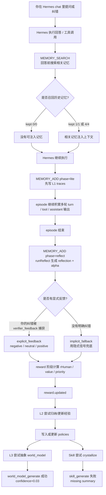

# Hermes + MemOS 远端真实数据流程分析

> 数据来源：远端服务器 `9.134.128.138` 上的 `~/.hermes/memos-plugin/data/memos.db`。  
> 说明：本文只摘取和解释关键字段，不展开认证信息、完整原文和敏感配置。

## 1. 这次远端数据里已经有什么

第一次核验时，远端数据库大致状态是：

| 表 | 数量 | 含义 |
| --- | ---: | --- |
| `traces` | 31 | L1 级执行痕迹 |
| `episodes` | 13 | 任务/话题单元 |
| `policies` | 1 | 已沉淀出的 L2 经验 |
| `world_model` | 1 | 已生成的 L3 环境认知 |
| `skills` | 0 | 还没有成功结晶的 Skill |
| `api_logs` | 192 | 记忆搜索、写入、反思、奖励、生成等过程日志 |

这说明系统已经不是只在做 `MEMORY_ADD` / `MEMORY_SEARCH` 了，而是已经走到了：

```text
L1 Trace -> Reward -> L2 Policy -> L3 World Model
```

但还没成功走到：

```text
Skill crystallization
```

也就是“经验已经出现了，但技能还没结晶成功”。

后续补查时，同一个远端库已经继续增长：

| 表 | 数量 | 含义 |
| --- | ---: | --- |
| `traces` | 72 | L1 级执行痕迹继续累积 |
| `episodes` | 17 | 任务/话题单元增加 |
| `policies` | 10 | L2 经验从 1 条扩展到 10 条 |
| `world_model` | 2 | L3 环境认知增加 |
| `skills` | 3 | 已出现 3 条候选 Skill |
| `api_logs` | 1038 | 反思、归纳、生成与查询日志显著增加 |

这说明链路后来已经跑过了 Skill crystallization，至少把部分 L2 policy 打包成了 `candidate` Skill。但这些 Skill 还不是成熟可用状态：`trials_attempted=0`、`trials_passed=0`、`usage_count=0`，说明它们只是“已生成、待验证”的候选能力。

## 2. 真实数据里的主线任务

远端数据里最明显的一条链路，是你围绕“联网搜索 / web-search skill / 是否跳过 skill 直接 curl”持续纠错。

关键 episode：

```text
episode: ep_czpezhp81wkd
session: 20260520_104813_cac061f4
```

里面有几条典型 L1 trace：

| trace | 内容摘要 | value / rHuman | 说明 |
| --- | --- | ---: | --- |
| `tr_jxw1d1sxz5kt` | 用户追问“你刚刚使用 skill 去搜索的，还是直接调用 bash？” | `value=-0.1587` / `rHuman=-0.165` | 这是一次纠错：Agent 承认没有加载 `web-search` skill，而是直接用 `curl` |
| `tr_j7hk6vb09fer` | 用户继续给截图，指出 Agent 多次忘记联网搜索 skill | `value=-0.165` / `rHuman=-0.165` | 进一步负反馈，明确“应先 `skill_view('web-search')`” |
| `tr_5ey2fvtbv0sw` | Agent 给出 XML 标签与 Claude 训练关系的搜索总结 | `value=-0.1429` / `rHuman=-0.165` | 任务结果有内容，但受前面“跳过 skill 流程”影响，被整体评为负向 |
| `tr_k9ezvjbehhg4` | 通过本地搜索端点查 Anthropic XML prompt 文档 | `value=-0.1486` / `rHuman=-0.165` | 工具行为本身被记录，但因为流程不符合用户预期，价值为负 |

这就是 MemOS 里“负反馈也有价值”的例子：它不是只记成功，也记录“用户纠正了什么、Agent 哪个行为模式错了”。

## 3. 你到底从哪里“点赞/踩”

之前我说“点赞/踩”不够准确。结合真实远端数据，应该这样讲：

**你在 Hermes chat 里没有 MemOS 专门的赞/踩按钮。**

但你的纠错话术会被 Hermes/MemOS 识别成显式反馈。例如远端 `feedback` 表里有：

```json
{
  "channel": "explicit",
  "polarity": "negative",
  "magnitude": 1.0,
  "source": "hermes.verifier_feedback",
  "episode_id": "ep_czpezhp81wkd"
}
```

也就是说，“显式反馈”在这里不是按钮，而是：

```text
用户在 chat 里明确纠错、追问、指出不符合预期
  -> Hermes verifier_feedback 捕获
  -> 写入 feedback 表
  -> reward 阶段使用它给 episode 打分
```

你这几句话就属于显式负反馈：

```text
你刚刚使用 skill 去搜索的，还是直接调用的 bash？
```

```text
你看看这个
```

配合截图上下文，系统判断为：用户在纠正 Agent 没有遵守 skill 流程。

## 4. 从 Hermes 提问到 L2 经验沉淀的真实流程

下面这张图按远端真实数据来画。



真实日志里能看到几个关键点：

```text
memory_add phase=lite stored=10
memory_add phase=reflect stored=10 warnings=1
task_failed rHuman=-0.165
skill_generate failed: missing summary
world_model_generate created wm_j069n86s6m9p
```

这说明系统确实按“先记录、再反思、再评分、再沉淀经验”的链路在跑。

## 5. 这条 L2 经验是什么

远端已经生成 1 条 policy：

```text
id: po_06y9qwkqf7w3
status: active
support: 1
gain: 1.00
confidence: 1.00
source episode: ep_czpezhp81wkd
```

页面上你看到的“经验”就是这条。

它的标题现在是：

```text
Success: 成功模式：[The user sent an image~ Here's what I can see: # Detailed Description of the...
```

这个标题有点噪声，说明当前 L2 归纳把“用户发的截图描述”当成了核心内容，标题没有很好地提取成“搜索前必须加载 web-search skill”这样的规则。

但真正有价值的“经验”其实出现在 `decision_repairs` 表里：

```text
preference:
Before performing any web search, always call skill_view('web-search') first
to load and follow the skill's defined procedure, rather than directly invoking curl or bash commands
```

```text
anti_pattern:
Agent repeatedly skips skill_view() and directly executes bare curl/bash commands
for web searches, even after acknowledging the correct flow multiple times
```

翻译成人话：

```text
以后只要要联网搜索，就先加载 web-search skill；
不要因为记得 API 地址，就直接裸调 curl/bash。
```

这才是这批数据真正沉淀出的经验。

## 6. 为什么 L3 也生成了，但看起来怪怪的

远端有 1 条 world model：

```text
id: wm_j069n86s6m9p
title: Docker chat interface data formatting environment
domainTags: ["docker"]
confidence: 0.03
source policy: po_06y9qwkqf7w3
```

它的内容大意是：

```text
没有足够证据恢复 Docker 环境结构；
证据主要是聊天截图和中文数据格式化工作流；
没有容器结构、文件路径、网络命名空间等 Docker 拓扑事实。
```

这条 L3 的价值很低，`confidence=0.03` 已经说明系统自己也不太信它。

为什么会这样？

因为前面的 L2 policy 被错误地打上了 `docker` 相关标签，证据又主要来自截图描述和搜索纠错，所以 L3 试图抽象“Docker 环境认知”时，发现没有足够环境事实，只能生成一个低置信度 world model。

这反而是一个很好的真实案例：

```text
L3 不一定都高质量；
它依赖 L2 的标签、证据和归纳质量；
低置信度 L3 应该谨慎使用，甚至后续可以归档。
```

## 7. 从 Skill 生成失败到候选 Skill 出现

第一次核验时，远端 `skills` 表是 0。

当时日志里有两次 `skill_generate`，都失败了：

```text
skill_generate failed
policyId: po_06y9qwkqf7w3
stage: crystallize
reason: llm-failed: skill.crystallize.invalid: missing summary
```

意思是：

```text
系统试图把这条 L2 policy 结晶成 Skill；
调用 skill.crystallize LLM prompt 成功返回了内容；
但返回 JSON 缺少必需字段 summary；
校验失败，所以没有写入 skills 表。
```

所以当时状态是：

```text
有经验 policy；
有低置信度 world model；
没有可调用 Skill。
```

后续补查时，`skills` 表已经出现 3 条 `candidate`：

| skill | status | support | gain | 来源 policy | 说明 |
| --- | --- | ---: | ---: | --- | --- |
| `ack_self_correction_summarize` | `candidate` | 28 | 0.2193 | `po_hd2pnjy1y219` | 用户表示“我已修正/不用帮我改”时，简短确认、总结学到的概念差异，然后停止继续动作 |
| `rebase_on_push_rejection` | `candidate` | 6 | 0.0258 | `po_epa5yvcjb3zt` | `git push` 因远端分叉被拒绝时，先 rebase、解决冲突，再 push，避免直接 force push |
| `web_search_via_skill_workflow` | `candidate` | 1 | 1.0 | `po_06y9qwkqf7w3` | 联网搜索前先加载 `web-search` skill，再按 skill 定义的流程执行，避免直接 curl/bash |

这里最容易误解的是 `support`。从表结构看，`skills.support` 不是前端临时算出来的，而是落在远端 SQLite 的 `skills` 表里；每个 skill 又通过 `source_policies_json` 指向来源 policy。当前 3 条 Skill 的 support 都和其来源 policy 一致：

```text
ack_self_correction_summarize <- po_hd2pnjy1y219: policy.support=28, skill.support=28
rebase_on_push_rejection      <- po_epa5yvcjb3zt: policy.support=6,  skill.support=6
web_search_via_skill_workflow <- po_06y9qwkqf7w3: policy.support=1,  skill.support=1
```

因此可以把当前 `skills.support` 理解为：Skill 从来源 policy 继承或转写来的成熟度/证据强度。它不等于 `evidence_anchors_json` 的条目数。比如 `web_search_via_skill_workflow` 有多条 evidence anchors，来源 policy 里也有多个 trace id 和 feedback id，但 policy 的支持度仍是 1，说明 anchors 更像展示/溯源样本，support 是 policy 归纳阶段单独计算出的支持度。

这 3 条都是候选 Skill，不是已经稳定启用的技能。判断成熟度还要看 `eta`、`trials_attempted`、`trials_passed`、`usage_count` 和后续用户反馈。

## 8. 用真实数据重讲四层

### L1 Trace：这次发生了什么

远端 L1 示例：

```text
tr_jxw1d1sxz5kt
```

记录的是：

```text
用户发截图追问：你刚刚是用 skill 搜索的，还是直接 bash？
Agent 承认：没有加载 web-search skill，直接 curl。
系统反思：混淆了“确认 skill 存在”和“读取 skill 内容指导操作”。
value=-0.1587, priority=0
```

L1 的作用是保留事实证据。

### L2 Policy：多次之后学到什么做法

远端 L2 当前生成为：

```text
po_06y9qwkqf7w3
```

但更清楚的经验表达应该是：

```text
触发：用户要求联网搜索，且系统存在 web-search skill。
做法：先调用 skill_view('web-search') 读取 skill 内容，再按其流程搜索。
反例：不要直接用 curl/bash 调搜索端点。
验证：搜索结果来自 skill 规定的流程，而不是裸调工具。
```

L2 的作用是把多个 L1 事实抽象成“下次怎么做”。

### L3 World Model：这个环境有什么规律

远端 L3 当前生成：

```text
wm_j069n86s6m9p
confidence=0.03
```

但它质量不高。更合理的 world model 应该是：

```text
环境：Hermes 云端环境里有 SearXNG / web-search 能力，但 Agent 不一定会自动加载 skill。
推理：如果用户要求联网搜索，而 Agent 直接 curl，用户会认为没有遵守 skill 流程。
约束：联网搜索任务必须先读 web-search skill；不能把“知道 endpoint”当作“遵守 skill”。
```

L3 的作用是描述环境规律，不是记录某次操作。

### Skill：可调用流程

这批数据后来确实结晶出了一个候选 Skill：

```text
skill name: web_search_via_skill_workflow
```

它的内容大概是：

```text
When to use:
用户要求搜索最新信息、官方资料、新闻、网页内容时。

Steps:
1. 调用 skill_view('web-search')。
2. 按 skill 中的搜索端点、参数、验证规则执行。
3. 汇总来源，避免编造。
4. 如果 skill 不存在或不可用，再说明 fallback。

Avoid:
不要直接凭记忆 curl localhost:8888/search。
```

Skill 的作用是把稳定经验变成下次可直接调用的流程包。

但这个例子也暴露了一个设计问题：`web_search_via_skill_workflow` 本质上不是“网页搜索能力本身”，而是“要求 Hermes 使用 `web-search` skill 的流程约束”。它更像一个元 Skill：

```text
不要直接 curl/bash；
先 skill_view('web-search')；
再按 web-search skill 的说明去搜索。
```

这条经验之所以会变成 Skill，是因为历史 trace 里出现过“Agent 知道有搜索端点，却绕过 web-search skill，直接 curl/bash”的负反馈。系统把这类纠错提炼成了“搜索前必须加载 skill”的流程。

从产品设计上，更自然的形态应该是：

```text
web-search 本身就是可调用 Skill；
MemOS 只需要记录一条 policy/preference：
遇到不确定、需要实时信息、官方资料或网页内容时，优先使用 web-search skill。
Agent Loop 在选择能力时直接命中 web-search，而不是再套一层“使用 web-search 的 Skill”。
```

所以 `web_search_via_skill_workflow` 有价值，但更适合作为 policy 或行为规则，不一定适合作为独立 Skill。尤其它当前的 trigger 曾被归纳成“当用户要求格式化或转换数据时”，这和网页搜索主题不匹配，说明自动结晶仍有噪声，需要人工审核或后续反馈修正。

## 9. 关键词解释

`Hermes chat`  
你实际使用的聊天入口。你只是在这里提问、追问、纠错，不直接操作 MemOS 内部表。

`MemOS`  
外部记忆系统。负责搜索历史记忆、写入新记忆、反思、评分、归纳经验、生成环境认知和技能。

`turn`  
一轮对话。通常是用户一句、助手一句，或者一次工具调用/工具结果也会被拆成可记录步骤。

`episode`  
一次任务或话题单元。比如“搜索 Anthropic 官方资料并解释 XML 标签”可以是一个 episode。一个 episode 可以包含多个 turn 和多个 tool traces。

`trace`  
执行痕迹。记录某一步发生了什么，包括用户输入、助手输出、工具调用、summary、reflection、value、tags 等。

`MEMORY_SEARCH`  
回答前检索记忆。日志里的 `kept 1/1` 表示搜到 1 条候选并保留 1 条注入上下文；`kept 0/0` 表示没有候选。

`MEMORY_ADD`  
写入记忆。`phase=lite` 是边聊边先写入 L1；`phase=reflect` 是 episode 结束后补 reflection 和 alpha。

`runLite`  
轻量写入阶段。先把当前 turn/工具调用写成 L1 trace，让系统马上有记录。

`runReflect`  
反思阶段。episode 结束后，系统回看整段任务，为每条 trace 生成 reflection 和 alpha。

`reflection`  
系统对某一步的复盘。比如“我直接 curl 而没有加载 skill，这是跳过流程”。

`alpha`  
reflection 质量权重。越高表示这条反思越可用，后续 reward/backprop 时更有参考价值。

`reward`  
奖励/满意度评分阶段。它会给 episode 一个 `rHuman`，再把价值回传到各条 trace。

`rHuman`  
用户满意度或任务级反馈分。远端例子里 `rHuman=-0.165` 表示该 episode 被判为负向；`rHuman=0.225` 表示另一个 Obsidian 保存任务被判为正向。

`value`  
回传到单条 trace 的价值分。正值代表有帮助，负值代表反例或失败信号。

`priority`  
未来召回优先级。负向或低价值 trace 往往 priority 为 0，但仍会保留为反例证据。

`explicit_feedback`  
显式反馈。这里不是按钮，而是你在 Hermes chat 里明确纠错、追问、指出错误，被 `hermes.verifier_feedback` 捕获成 feedback。

`implicit_fallback`  
没有明确反馈时的兜底评分。系统根据任务是否完成、上下文、工具结果等隐式信号估算 reward。

`policy`  
L2 经验。记录“什么情况下应该怎么做”。远端已经有 1 条 policy，但标题和标签还比较噪。

`decision repair`  
决策修复。系统从负反馈里提取“以后偏好什么 / 避免什么”。这次最有价值的是：搜索前必须先 `skill_view('web-search')`，避免直接 curl。

`world model`  
L3 环境认知。记录环境结构、规律和约束。远端当前有 1 条低置信度 world model，说明生成了，但质量不高。

`confidence`  
置信度。远端 world model 的 `confidence=0.03`，表示这条环境认知非常不可靠。

`skill`  
可调用能力包。比 policy 更成熟，包含调用说明、步骤、参数、证据和试用状态。远端后续已经生成了 3 条候选 skill，但还没有经过真实试用晋升为稳定能力。

`crystallize`  
结晶。把 L2 policy 打包成 Skill 的过程。第一次核验时失败原因是 `missing summary`；后续补查时已能生成候选 Skill。

`support`  
支持度。代表某条 policy 或 skill 的证据强度。对 Skill 来说，当前看到的 `skills.support` 来自其来源 policy，而不是前端临时计算，也不等于 `evidence_anchors_json` 的条目数。

`gain`  
收益。大致表示用了这条经验后比不用更好多少。当前 policy 显示 `gain=1.00`，但因为 support 只有 1，要谨慎看。

## 10. 当前真实数据的结论

这批远端数据已经证明 MemOS 在云端 Hermes 里跑通了：

```text
搜索记忆 -> 写入 L1 -> 反思 -> 奖励评分 -> 生成 L2 -> 生成 L3 / 候选 Skill
```

但质量上还有几个明显问题：

1. **L2 policy 标题噪声很大。** 它把截图描述塞进标题，没有提炼出“搜索前必须加载 web-search skill”这个核心经验。
2. **真正有价值的经验在 decision repair 里。** `preference` 和 `anti_pattern` 很准确。
3. **L3 world model 置信度极低。** `confidence=0.03`，说明它不应该被当成稳定环境知识。
4. **Skill 已经能生成，但仍是 candidate。** 当前 3 条 Skill 都还没有真实 trial 和 usage，不能视为成熟能力。
5. **`web_search_via_skill_workflow` 有过度包装倾向。** 它更像“使用 web-search skill 的规则”，未必应该独立成 Skill。
6. **下一步应优先修 Skill crystallize 的触发条件和命名质量。** 否则会继续生成 support 很低、trigger 噪声较大的候选 Skill。

最重要的一句话：

```text
这次远端数据已经学到了“联网搜索前必须先加载 web-search skill”，
并且后来已经结晶成 candidate Skill；
但更合理的系统形态可能是把它作为 web-search 的调用偏好/规则，
而不是单独包装成“使用 web-search 的 Skill”。
```
